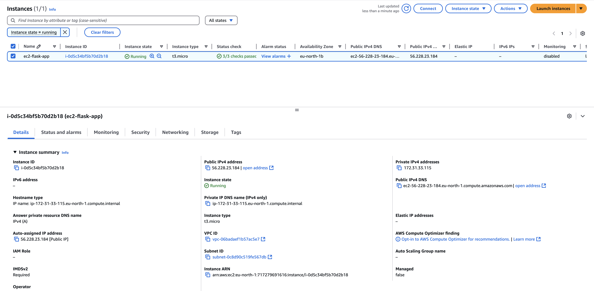
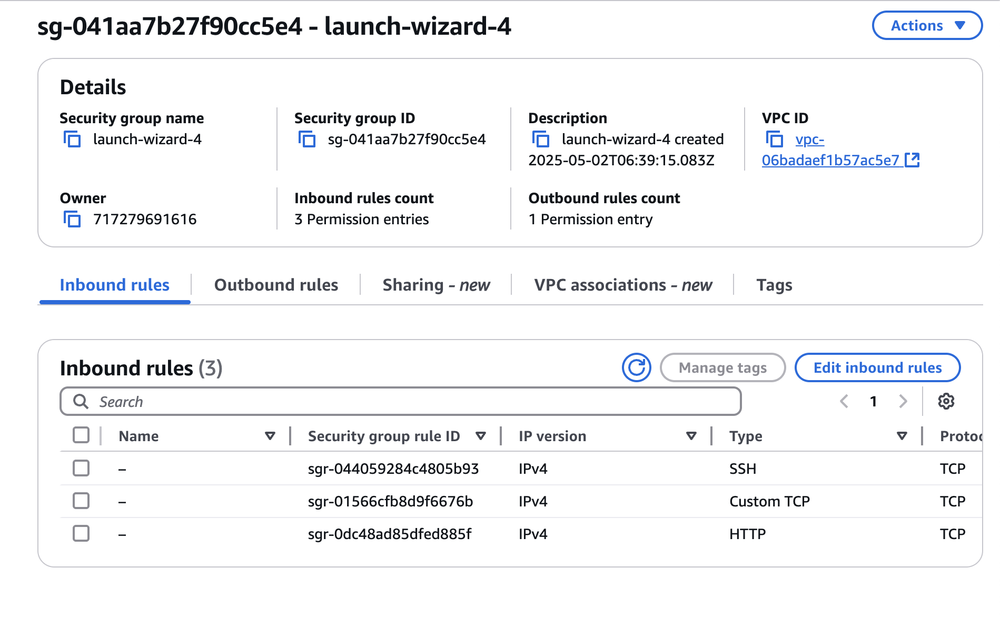
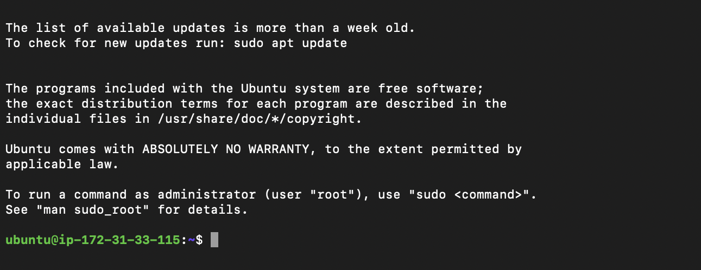
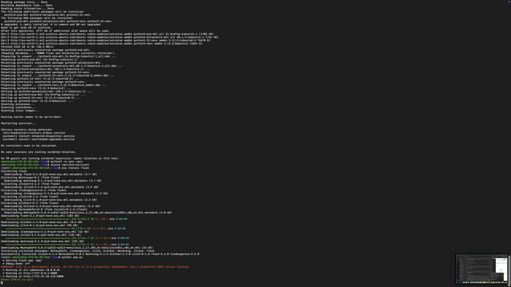
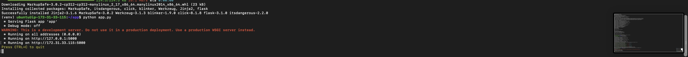
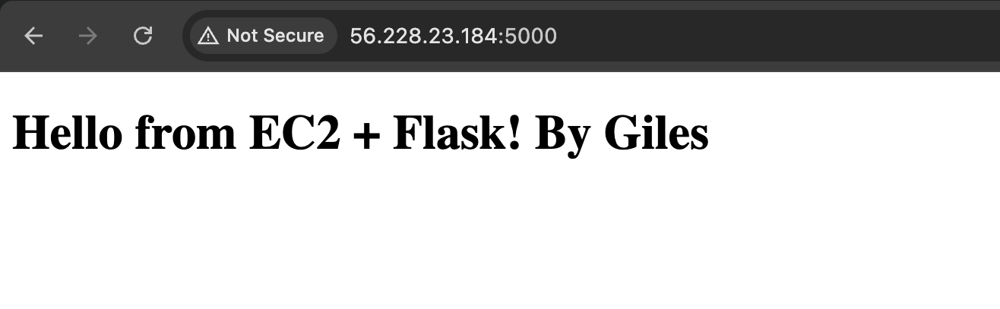

# 🚀 AWS EC2 Flask App Deployment

This project demonstrates how to deploy a simple Python Flask app on an AWS EC2 instance using a virtual environment.

## 🔧 Tech Used

- AWS EC2 (Ubuntu)
- Python 3 + Flask
- Linux terminal / SSH
- GitHub for version control

## 🌐 Live App
Deployed on EC2 at: `(http://56.228.23.184:5000/)'

## 🖼️ Screenshots

### EC2 Instance Configuration

### Security Group Rules

### SSH Connection

### Flask Installed in Virtual Environment

### Flask App Running

### Browser View

## 📄 Deployment Instructions

See `deployment_steps.md` for full setup.
